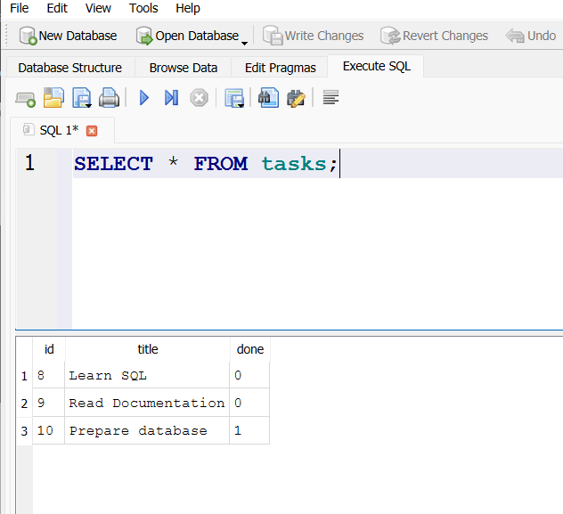

My first FlyRank assignment.
A "to do list".
This is a complete web loop. Full CRUD integrated system.
It fetches all the tasks, creates a task and adds it to the list, can fetch a singular task using its id, delete a task from the list and update a task's values.

To run this:
bash:
npm install && "npm start" or "node ./server.js"

Curl: 
curl -X 'GET' \
  'http://localhost:3000/tasks' \
  -H 'accept: */*'

#WHY SQLITE WAS CHOSEN

It was chosen because it only requires a single file, works as a standard database (retains data after restart), and requires no additional setup. 

#WHERE DATA LIVES

Data lives in "tasks.db". It is a locally created SQLITE file. It is created automatically on the first startup. 

